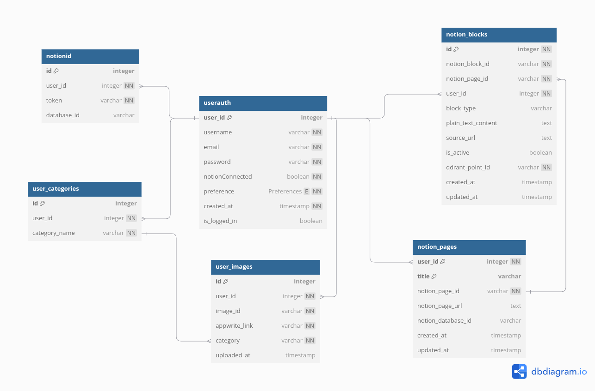

# Noteify — Intelligent Note Maker.

[Introduction](#introduction) | [Installation](#installation) | [Future Plans](#future-plans) | [Contributions](#contributions)

---

## Introduction

Noteify is an intelligent note-taking platform that uses a browser extension and combines note taking with AI, enabling users to capture, enrich, and organize information from any webpage directly into Notion. Designed for learners, researchers, and knowledge workers, Noteify streamlines knowledge workflows with AI-powered features.

---

## About Noteify

Noteify is a next-generation note-taking and knowledge management tool that bridges the gap between web content and your personal knowledge base in Notion (kinda your second brain). It empowers users to:

- **Seamlessly capture** highlights, text, code, and images from any webpage or PDF with a single click.
- **Leverage AI enrichment** to auto-categorize, summarize, and enhance notes using advanced LLMs and semantic search.
- **Personalize learning** by adapting to user feedback, learning from corrections, and suggesting new categories tailored to your interests.
- **Integrate deeply with Notion**, ensuring your notes are well-formatted, organized, and instantly accessible.
- **Store and search embeddings** for deduplication and smarter retrieval, powered by Cohere and Qdrant.
- **Prioritize privacy and security** by keeping sensitive data on your own infrastructure and using encrypted sessions.

Noteify is ideal for students, researchers, and professionals who want to supercharge their knowledge workflows, reduce manual organization, and unlock the power of AI for personal knowledge management.

---

##  Features

###  Browser Extension
- One-click note capture from any webpage or online PDFs
- Supports rich text, code blocks, and image capture
- Seamless OAuth2 integration with Notion
- Floating UI overlay with categorization suggestions
- PDF.js-based custom viewer for highlighting PDF content

###  AI & Enrichment
- LLM-based auto-categorization of notes using RAG (Retrieval augmented generation)
- Embedding generation via Cohere and semantic search using Qdrant
- Content enrichment using prompt-based LLM responses
- Suggests new categories if none match confidently

###  Notion Integration
- Notes are auto-uploaded to Notion with proper formatting.
- Image storage in Appwrite S3 and custom image viewer for CDN-safe viewer links.
- Markdown/HTML rendering for better Notion block formatting

###  User Personalization
- Learns from user-corrected categories
- Stores examples to improve classification accuracy per user
- Custom category creation with similarity normalization
- Dynamic few-shot context building from personal note history

---

## Architecture

###  Components

| Component          | Description |
|-------------------|-------------|
| **Extension (Frontend)** | Injects UI, handles highlight/capture actions, and communicates with the backend |
| **FastAPI Backend (MCP Server)** | Manages auth, Notion communication, AI enrichment, user preferences |
| **PostgreSQL** | Stores user data, note metadata, preferences, and interactions |
| **Qdrant Cloud** | Stores embeddings for semantic deduplication & personalized few-shot learning |
| **Appwrite S3** | Object store for image uploads |
| **Notion API** | Target platform for note storage |
| **Cohere and Groq** | Used to generate embeddings and categorize notes |
| **Nginx** | Set up a Reverse proxy server for load balancing and rate limiting|

---


###  Database Schema Highlights




---

##  Tech Stack

| Layer         | Tech |
|--------------|------|
| Frontend     | JavaScript, HTML/CSS, PDF.js |
| Extension    | Chrome MV3, Content Scripts, DOM Injection |
| Backend      | FastAPI, SQLAlchemy, Pydantic |
| Database     | PostgreSQL, Alembic |
| Vector DB    | Qdrant Cloud (Cohere embeddings) |
| Storage      | Appwrite S3 |
| Auth         | JWT (Cookie-based) + OAuth2 (Notion) |
| LLM inference Model     | Groq API / Cohere LLMs |

---

##  Deployment

- Hosted on Ola Cloud Platform VM (Krutrim)
- Reverse proxy using Nginx on port `443` and `80`

---

## Installation

### Browser Extension

1. **Clone the repository:**
   ```bash
   git clone https://github.com/Swam244/noteify.git
   cd noteify/extension
   ```
2. **Load into your browser:**
   - Go to `chrome://extensions/` (or your browser's extension page).
   - Enable "Developer mode".
   - Click "Load unpacked" and select the `dist` or `build` folder.

### Backend (FastAPI Server) using UV

*The following instructions use `uv`, a fast Python package installer and resolver. If you don't have it, you can install it following the [official guide](https://astral.sh/docs/uv#installation) or use standard `venv` and `pip`.*

1. **Navigate to the backend directory:**
   ```bash
   cd ../backend
   ```
2. **Create virtual environment:**
   - `uv .venv` creates the virtual environment.
   ```bash
   uv venv 
   source .venv/bin/activate
   ```
3. **Install dependencies:**
   Use `uv sync` to install dependencies from `pyproject.toml` or `requirements.txt`. It's faster and ensures the environment matches the project's requirements.
   ```bash
   uv sync
   ```
4. **Set up environment variables:**
   - Create `.env` in the current directory and fill in your credentials (Notion, Qdrant, Appwrite, etc.)
5. **Run database migrations:**
   ```bash
   alembic upgrade head
   ```
6. **Start the server from the backend directory:**
   ```bash
   uvicorn app.main:app --reload
   ```

### PostgreSQL & Qdrant Setup
- Ensure PostgreSQL and Qdrant are running and accessible as per your `.env` configuration.

### Notion & Appwrite Setup
- Register your Notion integration and Appwrite project, and update the credentials in `.env`.

---

## Future Plans

- **User Dashboard :** Tagging, editing, and export features for better note management.
-  **Note-based Quizzes :** Generate quizzes from your captured notes to aid learning and retention.
- **Advanced Tagging :** User specific tagging and filters for improved organization .
- **Extension UI :** Need to improve and make it more responsive.
- **Support for Audio notes :** Add features for audio transcription and raw audio storage on notion.
- **Offline notes :** Add support for offline queuing and send on internet connection.
- **OCR :** OCR on images for extracting info for enhancement and summarization.
- **Support Questions on knowledge base :** Integrate a chatbot for answering questions on existing knowledge base.

---

## Contributions

This is currently a solo project but contributions, feedback, and ideas are welcome. Open an issue or email me directly at my [mail](mailto:swayamsjain2242@gmail.com) if you're interested in collaborating.

---
